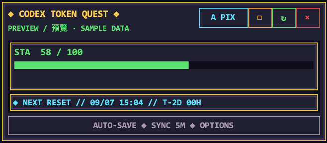
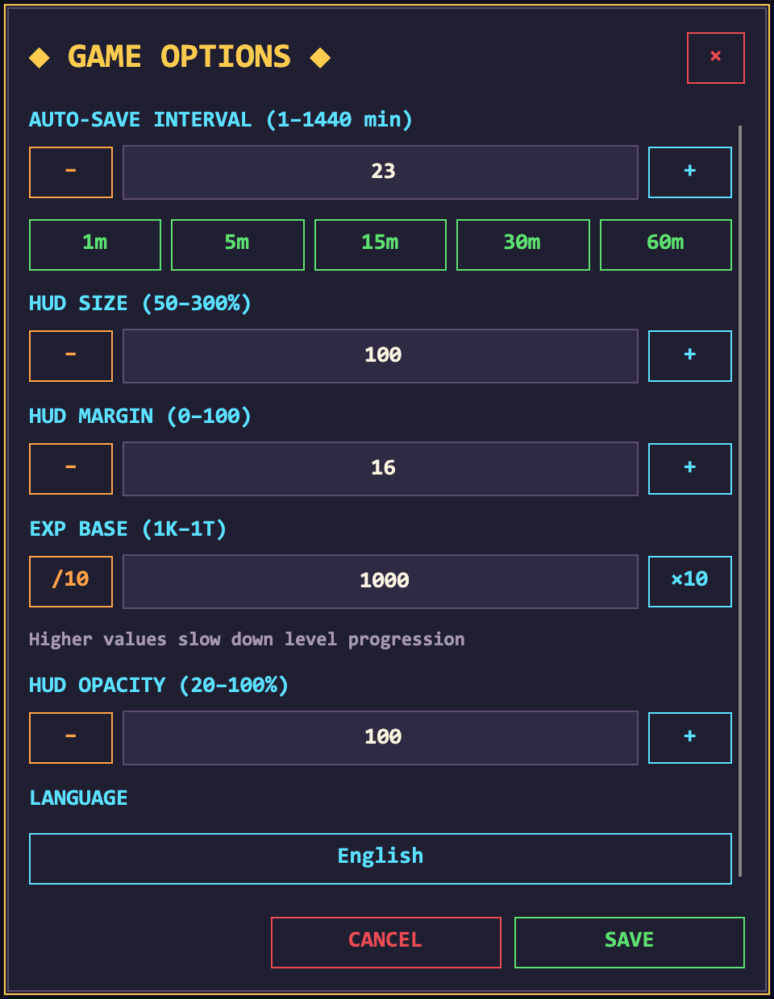
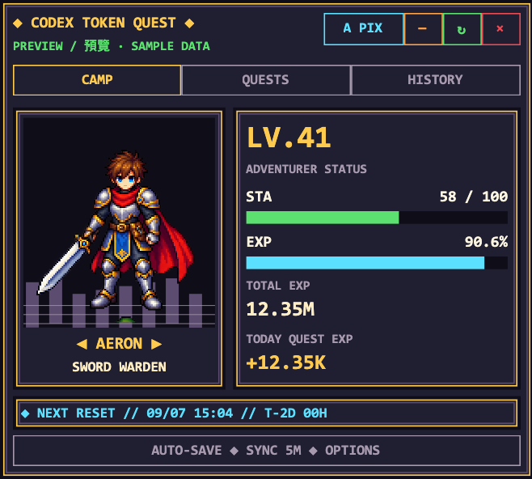
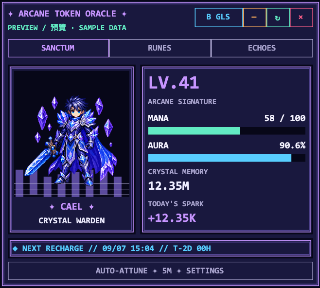
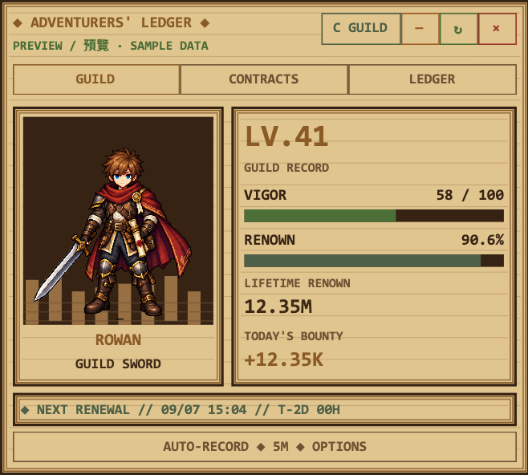
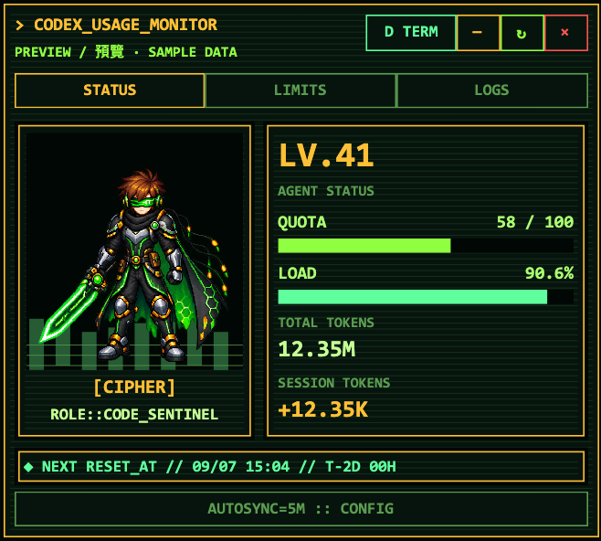

# Codex Token Quest

English | [正體中文](README.zh-Hant.md)

A read-only pixel RPG HUD for Codex Desktop. **Windows and macOS share one C# / Avalonia UI and .NET 10 core.** Native window adapters and small bootstrap scripts contain the OS differences; there are no separate product implementations.

- Quota windows, used / remaining percentages, local reset times, countdowns and available reset credits.
- CAMP, QUESTS, HISTORY and compact view.
- Levels 1–99; four heroes unlocked at levels 1, 10, 25 and 50.
- Pixel Dungeon, Arcane Glass, Guild Ledger and Code Terminal themes.
- English / Traditional Chinese, 50–300% scaling, margins, 20–100% opacity and a 1K–1T experience base.
- Five-minute refresh by default, configurable from 1–1440 minutes, with per-second countdowns.
- Windows tray / Mac menu bar actions for visibility, panels, refresh, settings and exit.

The default 100% HUD size equals the previous 80% size. Saved percentages are converted to the new baseline once, within the 50–300% range.

The HUD uses the original Windows **Consolas Bold** font on both systems when installed, falling back to Menlo or Courier New on Mac. Consolas is not bundled with the plugin; install your locally available copy on Mac to match Windows. The bottom reset line includes the label, local date/time and localized `T-` countdown.

Today's local session token increments supplement delayed account data. When both sources are available, the larger value is used. Failed refreshes retain the last data with an error indicator; hover the error for details and retry.

## Screenshots

These screenshots show the shared Windows/macOS Avalonia interface with sample data.

### Compact view



### Game options

Settings follow the selected HUD theme, including colors, pixel borders and adjustment buttons. Save and Cancel stay at the bottom; changing the HUD theme while settings are open preserves unsaved values.



### Visual themes

| Pixel Dungeon | Arcane Glass |
| :---: | :---: |
|  |  |
| **Guild Ledger** | **Code Terminal** |
|  |  |

## Requirements

- Windows (validated on Windows 11 ARM) or Apple Silicon macOS.
- A **stable .NET 10 SDK**, not just the runtime. Install it from [Microsoft](https://dotnet.microsoft.com/download/dotnet/10.0). The Mac bootstrap also discovers `~/.dotnet/dotnet`.
- Codex CLI authenticated with a ChatGPT account. The resolver checks PATH first, then common Homebrew, user and desktop-bundled locations.
- NuGet access for the initial Avalonia restore.

API-key-only and Amazon Bedrock authentication do not provide ChatGPT token activity summaries. Linux and Intel Macs are outside this release's scope.

## Run

Windows:

```powershell
.\scripts\start-desktop.ps1
```

Mac:

```sh
sh ./scripts/start-desktop.sh
```

Both entry points detach promptly. The shared C# launcher checks source changes, serializes builds, prevents duplicate instances and prepares the local app. The first launch takes time to build; inspect logs and retry if it fails. Outputs are isolated by runtime under `artifacts/`, including when a folder is shared between Windows and Mac.

One `hooks/hooks.json` handles both `SessionStart` and `UserPromptSubmit`: `command` uses the Mac shell bootstrap and `commandWindows` uses PowerShell. `${PLUGIN_ROOT}` resolves the installation path, including spaces. No skill, MCP server, login startup entry or task scheduler is added.

The legacy `install-autostart.ps1` still removes old Windows login / scheduled startup entries and invokes the current bootstrap. After updating the sources, quit the HUD from its tray / menu bar and launch again to rebuild.

## macOS Accessibility

The first launch explains how to allow **Codex Token Quest** in **System Settings → Privacy & Security → Accessibility**. To add the app manually, use:

```text
~/Library/Application Support/CodexTokenQuest/Codex Token Quest.app
```

While permission is missing, denied or revoked, tracking pauses and the menu bar remains available. Tracking is checked again after authorization. Quit and relaunch if macOS requests it.

The app uses a fixed bundle ID and location. Rebuilding its locally ad-hoc-signed executable can still require reauthorization; if needed, remove the old Accessibility entry and add the app at the path above. This source workflow does not include Developer ID signing, notarization or public installer packages.

## Window behavior and storage

The HUD follows the active Codex window's bottom-right corner. Losing focus does not hide the HUD. It hides when the host is minimized, hidden or on another desktop. On Mac, the HUD retains floating window level even while Codex is inactive. HUD controls and settings remain usable. A manually hidden HUD stays hidden until restored from the tray / menu bar. It exits five seconds after the Codex desktop process disappears.

On Mac the host is identified by bundle ID `com.openai.codex`, including installations named `ChatGPT.app`. On Windows desktop windows and package identity identify the host; CLI processes are excluded. The companion does not inject code into or modify Codex.

| OS | Settings and logs |
| --- | --- |
| Windows | `%LocalAppData%\CodexTokenQuest` |
| macOS | `~/Library/Application Support/CodexTokenQuest` |

`settings.json` preserves existing Windows fields and values. `lifecycle.log` records launch and host state; `bootstrap.log` records SDK and bootstrap failures. `CODEX_HOME` remains supported for local sessions.

## Development and validation

If your Mac terminal still selects an older SDK, use `~/.dotnet/dotnet` in place of `dotnet` below. The launcher discovers .NET 10 automatically.

```sh
dotnet build CodexTokenQuest.slnx --configuration Release
dotnet run --project tests/CodexTokenQuest.Tests --configuration Release
# Render 4 themes × 2 languages × 4 panel modes × 4 data states
dotnet run --project tests/CodexTokenQuest.Tests --configuration Release -- --render
# Sample data, no account access or settings writes
dotnet run --project src/CodexTokenQuest.Desktop -- --preview --language en --theme 0 --panel CAMP
```

Tests cover parsing, local tokens, lifecycle, placement, legacy settings, CLI resolution, interprocess leases, crash recovery, build fingerprints and App Server error recovery. Native tracking, mixed DPI, full-screen / Spaces, focus and authorization still require desktop validation. See the [validation record](docs/validation.md).

The solution contains Core (data and shared policies), Desktop (shared Avalonia UI and platform adapters), Launcher (shared startup logic), and Tests.

## Data sources

Only the read-only Codex App Server JSONL methods `account/rateLimits/read` and `account/usage/read` are called. The app never consumes reset credits and does not directly read or store access tokens or API keys.

Some CLI versions do not implement `account/usage/read`. The HUD tries PATH first; when that server lacks the endpoint, it checks other installed CLIs, including the Codex desktop app's bundled CLI, and switches to one that supplies account usage. Quota and totals are always read from the same server with the inherited `CODEX_HOME`. If none supports the endpoint, quota, reset times and local today's tokens continue refreshing, while lifetime totals and derived level/experience remain unavailable. A short localized notice stays inside the HUD; protocol and CLI selection details go to `lifecycle.log`. Temporary usage errors are retried on the next refresh.
