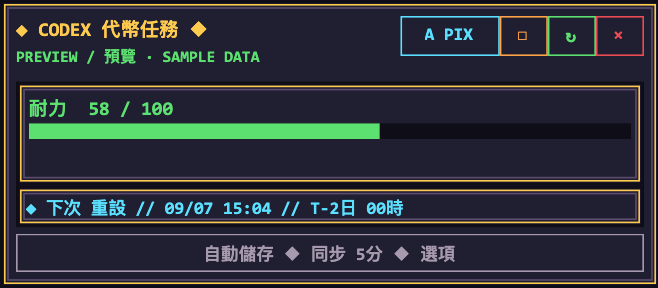
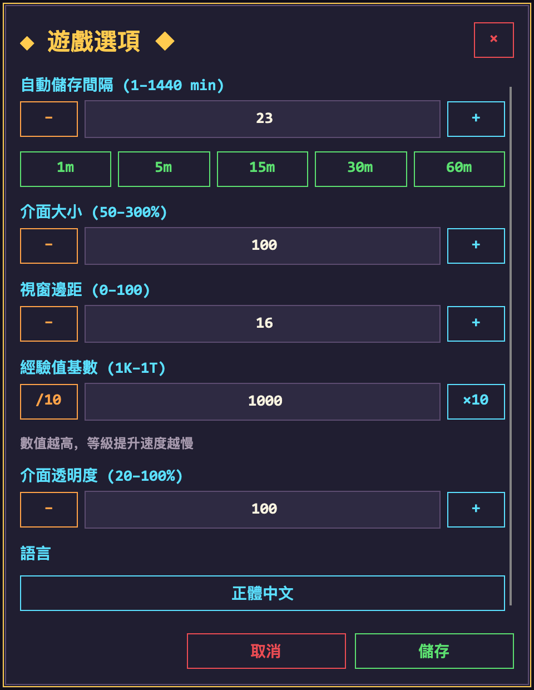
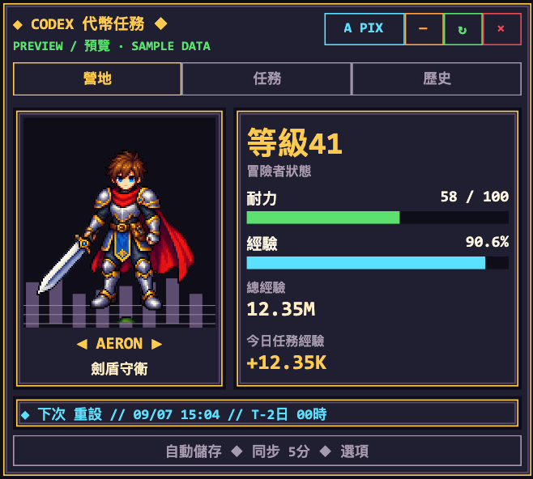
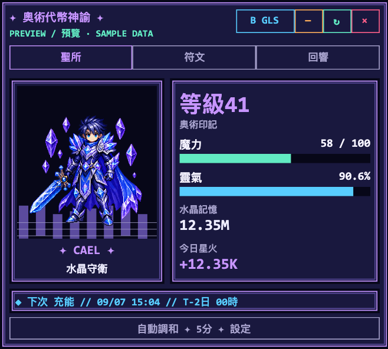
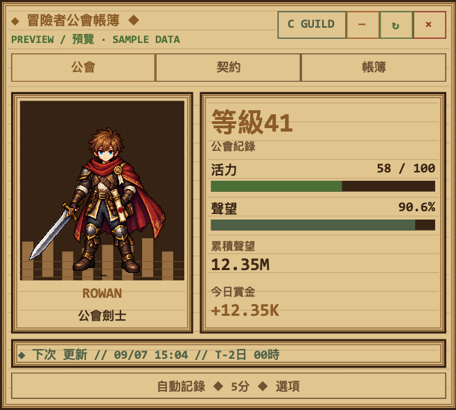
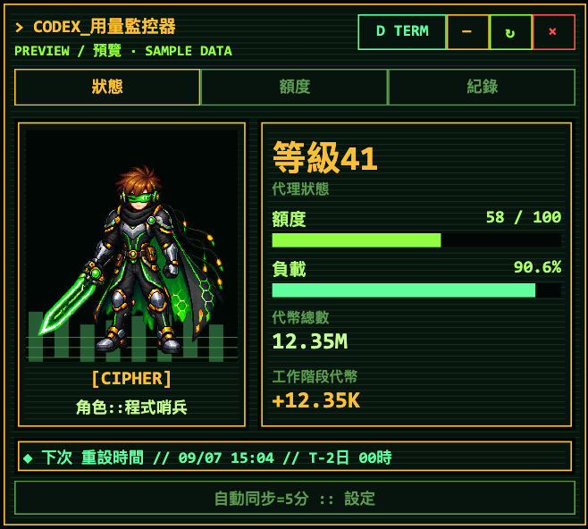

# Codex Token Quest

[English](README.md) | 正體中文

適用於 Codex Desktop 的唯讀像素 RPG HUD。**Windows 與 macOS 使用同一套 C#／Avalonia 介面與 .NET 10 核心**；作業系統差異集中在原生視窗 adapter 和啟動入口，沒有分成兩個產品版本。

- 額度視窗、已用／剩餘百分比、本地時間的重設倒數與可用重設次數。
- CAMP、QUESTS、HISTORY 三個面板與精簡模式。
- 1–99 級經驗進度，四名英雄於 1、10、25、50 級解鎖。
- Pixel Dungeon、Arcane Glass、Guild Ledger、Code Terminal 四個主題。
- 英文／正體中文、50–300% 縮放、0–100 邊距、20–100% 透明度、1K–1T 經驗基數。
- 預設每 5 分鐘更新，可設定為 1–1440 分鐘；倒數每秒更新。
- Windows 通知區／Mac 選單列提供顯示、隱藏、切換面板、刷新、設定與離開。

預設 100% 尺寸等於原本的 80%。舊設定的百分比會換算為新基準，並維持在 50–300% 範圍內；儲存後不會重複換算。

帳號用量缺少今日數值時，會使用本地 Codex 工作階段 Token 增量；兩者都有資料時取較高值。資料讀取失敗會保留上次資料並標示錯誤，可將滑鼠移至錯誤文字查看原因，再按重新整理。

介面優先使用原 Windows 版的 **Consolas 粗體**；Mac 已安裝時會使用相同字型，否則依序使用 Menlo、Courier New。外掛不附帶 Consolas 字型檔，Mac 可安裝本機已有的字型以配合 Windows。底部重設列保留完整標籤、本地日期時間與中文／英文 `T-` 倒數。

## 畫面截圖

以下為 Windows／macOS 共用 Avalonia 介面的截圖，內容使用範例資料。

### 精簡模式



### 遊戲選項

設定視窗會跟隨 HUD 選用的主題，包含配色、像素邊框與調整按鈕。儲存／取消固定於底部；設定開啟期間切換 HUD 樣式，尚未儲存的數值會保留。



### 四種樣式

| Pixel Dungeon | Arcane Glass |
| :---: | :---: |
|  |  |
| **Guild Ledger** | **Code Terminal** |
|  |  |

## 系統需求

- Windows（已驗證 Windows 11 ARM）或 Apple Silicon macOS。
- **.NET 10 SDK 正式版**，只有 Runtime 不足以從原始碼啟動。從 [Microsoft](https://dotnet.microsoft.com/download/dotnet/10.0) 安裝；Mac 也會偵測 `~/.dotnet/dotnet`。
- 已登入 ChatGPT 帳號的 Codex CLI。程式會先搜尋 PATH，再檢查 Homebrew、使用者安裝與 Codex Desktop 常見附帶位置。
- 首次建置需連線至 NuGet 取得 Avalonia 套件。

僅 API Key 或 Amazon Bedrock 驗證不提供 ChatGPT Token 活動摘要。此次不涵蓋 Linux 或 Intel Mac。

## 啟動

Windows：

```powershell
.\scripts\start-desktop.ps1
```

Mac：

```sh
sh ./scripts/start-desktop.sh
```

兩個入口都會立即交給背景程序；共用 C# Launcher 負責建置判斷、防止重複啟動及建立本地 App。首次啟動需等候建置，失敗後可檢查記錄並重試。建置產物以執行環境分開存放於 `artifacts/`，避免共享資料夾中的 Mac／Windows 輸出互相覆寫。

同一份 `hooks/hooks.json` 使用 `SessionStart` 和 `UserPromptSubmit`。`command` 啟動 Mac shell 入口，`commandWindows` 啟動 Windows PowerShell 入口；路徑透過 `${PLUGIN_ROOT}` 解析，含空白的安裝路徑也可使用。沒有新增 Skill、MCP Server、登入啟動項目或排程器。

舊版 `install-autostart.ps1` 仍可移除既有的 Windows 登入／排程啟動方式，並呼叫現行入口。更新原始碼後，請從選單列／通知區結束 HUD 再啟動，讓更新生效。

## Mac 輔助使用權限

第一次啟動時，HUD 會提示開啟「系統設定 → 隱私權與安全性 → 輔助使用」，請授予 **Codex Token Quest** 權限。若需手動加入 App，其位置是：

```text
~/Library/Application Support/CodexTokenQuest/Codex Token Quest.app
```

未授權、拒絕或撤銷權限時，HUD 暫停跟隨，選單列入口仍可操作；授權後會重新偵測。若系統要求重新啟動，請結束 HUD 後再次執行啟動腳本。

本地 App 使用固定 Bundle ID 與安裝位置，但原始碼重建後的 ad-hoc 簽章可能使 macOS 要求重新授權；必要時將輔助使用清單中的舊項目移除，再加入上述 App。此工作流程不包含 Developer ID 簽署、公證或公開下載的安裝包。

## 視窗與設定

HUD 位於目前 Codex 主視窗的右下角，隨移動、縮放和螢幕切換重新定位。主程式失去焦點時保留 HUD；最小化、隱藏或位於其他桌面時才隱藏。Mac 切到其他 App 時，HUD 保持浮動層級，避免被 Codex 主視窗蓋住；操作 HUD 或其設定時仍可使用。手動隱藏後須由通知區／選單列恢復。Codex 程序離開五秒後，HUD 會結束。

Mac 依 `com.openai.codex` Bundle ID 辨識主程式，支援名稱為 `ChatGPT.app` 的 Codex。Windows 依桌面視窗及套件身分辨識，CLI 背景程序不會被當成桌面主程式。HUD 不注入或修改 Codex。

設定及記錄位置：

| 系統 | 目錄 |
| --- | --- |
| Windows | `%LocalAppData%\CodexTokenQuest` |
| macOS | `~/Library/Application Support/CodexTokenQuest` |

`settings.json` 保留舊 Windows 欄位與數值；`lifecycle.log` 記錄啟動和視窗狀態，`bootstrap.log` 記錄 SDK／入口錯誤。`CODEX_HOME` 仍可指定本地工作階段目錄。

## 開發與驗證

若 Mac 的終端機仍選到舊 SDK，可將下列 `dotnet` 改為 `~/.dotnet/dotnet`。啟動腳本會自動尋找 .NET 10。

```sh
dotnet build CodexTokenQuest.slnx --configuration Release
dotnet run --project tests/CodexTokenQuest.Tests --configuration Release
# 額外產生 4 主題 × 2 語言 × 4 面板 × 4 資料狀態的介面測試圖
dotnet run --project tests/CodexTokenQuest.Tests --configuration Release -- --render
# 不讀取帳號、不儲存設定的範例資料預覽
dotnet run --project src/CodexTokenQuest.Desktop -- --preview --language zh-Hant --theme 0 --panel CAMP
```

測試涵蓋解析器、本地 Token、生命週期、定位、舊設定相容性、CLI 解析、跨程序鎖、崩潰後重啟、來源指紋與 App Server 錯誤恢復。視窗跟隨、混合 DPI、全螢幕／Spaces、焦點及權限仍需在相應桌面環境驗證；詳見 [驗證記錄](docs/validation.md)。

方案由 Core（資料及共用策略）、Desktop（共用 Avalonia 介面與平台 adapter）、Launcher（共用啟動流程）及 Tests 組成。

## 資料來源

部分 CLI 版本未實作 `account/usage/read`。HUD 先嘗試 PATH；若該版本缺少端點，再檢查其他已安裝 CLI（包含 Codex 桌面版內附版本），切換至可讀取累計用量的版本。額度與累計用量始終來自同一個 App Server，並沿用 `CODEX_HOME`。若所有版本都不支援，仍會更新額度、倒數與本機今日 Token，累計用量及其衍生的等級、經驗才標示為未知。介面僅顯示簡短提示，完整協定與 CLI 選擇訊息寫入 `lifecycle.log`；暫時性用量錯誤會在下次更新時重試。

只呼叫 Codex App Server JSONL 的 `account/rateLimits/read` 和 `account/usage/read`，不呼叫使用重設次數的端點，不直接讀取或儲存 Access Token／API Key。
